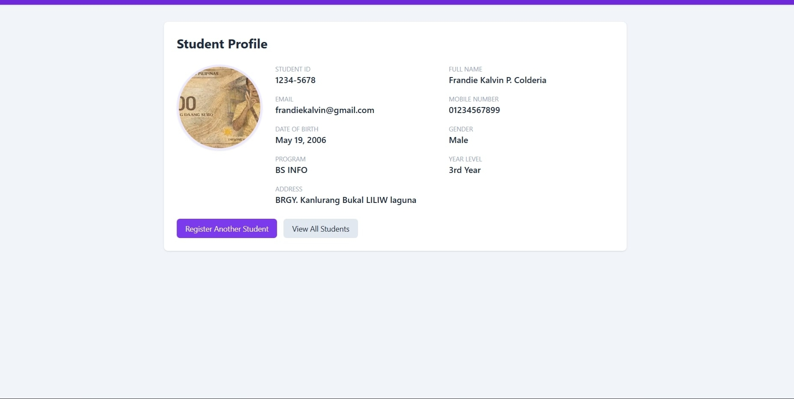

# Week 04 - Student Registration System

## 1. Project Overview

The Student Registration System is a web-based application developed using Laravel. 
It allows users to register students by providing their personal and academic information.

The system includes student information validation, profile picture upload, database storage,
and a page for viewing registered students.

## 2. Objectives

- To create a functional student registration system using Laravel.
- To implement server-side validation for student information.
- To store student records in a database.
- To allow profile picture uploads.
- To display registered student information.
- To understand the Laravel request and validation lifecycle.

## 3. Technologies Used

- Laravel
- PHP
- MySQL
- HTML
- CSS
- Tailwind CSS
- GitHub

- ## 4. System Features

- Student registration form
- Student ID validation
- Email address validation
- Mobile number validation
- Date of birth validation
- Gender and year level selection
- Profile picture upload
- Database storage of student records
- Display of registered student information
- Validation error messages
- Successful registration confirmation

- ## 5. Validation

The system uses server-side validation to make sure that the information entered by the user is valid and complete.

The following validations were implemented:

- Student ID must be unique.
- Mobile number must contain digits only.
- Mobile number must contain between 7 and 15 digits.
- Date of birth is required.
- Email address must have a valid email format.
- Required student information must not be empty.

When invalid information is submitted, the system displays clear error messages to help the user correct the input.

## 6. Profile Picture Upload

The system allows users to upload a profile picture during student registration.

The uploaded image is accepted in JPG or PNG format with a maximum file size of 2 MB. The system stores the uploaded profile picture and displays it on the student's profile after successful registration.



## 7. Database

The Student Registration System uses MySQL as its database.

Student information such as student ID, name, email, mobile number, date of birth, gender, program, year level, address, and profile picture is stored in the database.

The database allows the system to save and retrieve student records efficiently.


## 8. Required Diagrams

### 8.1 Registration Flowchart

```text
+----------------------+
|        START         |
+----------+-----------+
           |
           v
+----------------------+
| Open Registration    |
| Form                 |
+----------+-----------+
           |
           v
+----------------------+
| Enter Student        |
| Information          |
+----------+-----------+
           |
           v
+----------------------+
| Validate Information |
+----------+-----------+
           |
           v
      +----+----+
      | Valid?  |
      +----+----+
       /       \
     NO         YES
     |           |
     v           v
+---------+   +----------------+
| Display |   | Save Student   |
| Errors  |   | Information    |
+----+----+   +-------+--------+
     |                |
     +--------+-------+
              |
              v
      +----------------+
      | Display Student|
      | Profile        |
      +-------+--------+
              |
              v
      +----------------+
      |      END       |
      +----------------+

+--------------------------------+
|           STUDENTS             |
+--------------------------------+
| PK  id                         |
|     student_id                 |
|     first_name                 |
|     middle_name                |
|     last_name                  |
|     email                      |
|     mobile_number              |
|     gender                     |
|     date_of_birth              |
|     program                    |
|     year_level                 |
|     address                    |
|     profile_picture            |
|     created_at                 |
|     updated_at                 |
+--------------------------------+
+------------------+
|       USER       |
+--------+---------+
         |
         v
+------------------+
|  Browser / Form  |
+--------+---------+
         |
         v
+------------------+
|      ROUTE       |
|     web.php      |
+--------+---------+
         |
         v
+------------------+
|    MIDDLEWARE    |
+--------+---------+
         |
         v
+------------------+
|    CONTROLLER    |
| StudentController|
+--------+---------+
         |
         v
+------------------+
|    VALIDATION    |
+--------+---------+
         |
         v
+------------------+
|   STUDENT MODEL  |
+--------+---------+
         |
         v
+------------------+
|     DATABASE     |
|      MySQL       |
+--------+---------+
         |
         v
+------------------+
|     RESPONSE     |
+--------+---------+
         |
         v
+------------------+
|   BLADE VIEW     |
+--------+---------+
         |
         v
+------------------+
|       USER       |
+------------------+

## 8. Testing and Results

The system was tested by submitting both valid and invalid student information. The validation features were checked to ensure that incorrect or incomplete inputs were properly rejected.

The registration form was also tested for profile picture uploads and successful student registration. The system displayed appropriate validation messages when invalid information was entered and confirmed successful registration when all required information was valid.

### Test Results

- Valid student information — Successful
- Invalid Student ID — Validation error displayed
- Invalid email address — Validation error displayed
- Invalid mobile number — Validation error displayed
- Empty required fields — Validation error displayed
- Profile picture upload — Successful
- Student registration — Successful

- ## 9. Problems Encountered

During the development of the Student Registration System, several challenges were encountered:

- Validation errors had to be properly displayed when users entered invalid information.
- The profile picture upload required correct file format and size validation.
- Managing and storing student information correctly was challenging during development.

- ## 10. Solutions

The problems encountered during development were solved by carefully checking the validation rules and testing different types of user input.

- Validation errors were solved by implementing proper server-side validation rules and displaying clear error messages.
- Profile picture upload issues were addressed by checking the file type and maximum file size before storing the image.
- Student information was properly handled by validating the input before saving the records.

Testing the system repeatedly helped identify and fix errors before the final registration process.

## 11. Reflection

Working on the Student Registration System gave me a better understanding of how a web application works from input to output. Before developing this project, I understood basic programming concepts, but I had a limited understanding of how different parts of a web application work together. Through this activity, I was able to see how a registration form, validation, database-related processes, file uploads, and the user interface are connected.

One of the most important things I learned was the importance of validation. A registration system should not simply accept any information entered by the user. The data needs to be checked to make sure that it is complete and follows the required format. Testing different inputs helped me understand why validation is important in preventing incorrect or incomplete information from being processed.

I also learned more about handling profile picture uploads. At first, file uploads seemed simple, but I realized that the system needs to check the file type and size before accepting an image. This helped me understand that applications need to handle user-provided files carefully and consistently.

Another important lesson from this project was troubleshooting. There were situations where the expected result did not immediately appear, so I had to check the form, validation rules, and overall process to understand what was causing the problem. Instead of simply trying random changes, I learned that checking each part of the process step by step makes it easier to identify errors.

The project also improved my understanding of organizing information. A student registration system contains many different pieces of information, including personal and academic details. Presenting these details in an organized way makes the system easier for users to understand and use.

I also realized that documentation is an important part of software development. A working application is not the only thing that matters. Developers should also be able to explain the purpose of the project, its features, the problems encountered, and the solutions used. Screenshots are also useful because they provide visual evidence of the system's functionality.

Overall, this project helped me become more comfortable with Laravel and web application development. It allowed me to apply concepts that I had previously learned separately and see how they work together in one project. I learned that developing an application requires patience, testing, problem-solving, and attention to detail. The experience also showed me that errors are a normal part of development and can be used as opportunities to improve my understanding. This project gave me more confidence in working with Laravel and encouraged me to continue learning how to develop better and more organized web applications.

## 12. References

- Laravel Documentation. (n.d.). Laravel documentation. https://laravel.com/docs
- PHP Documentation Group. (n.d.). PHP manual. https://www.php.net/docs.php
- MySQL. (n.d.). MySQL documentation. https://dev.mysql.com/doc/
- GitHub Docs. (n.d.). GitHub documentation. https://docs.github.com/

- 


